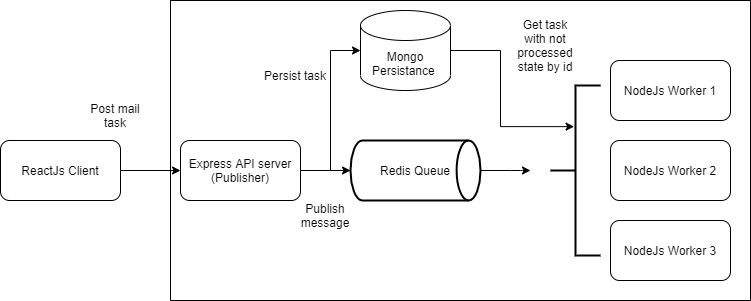
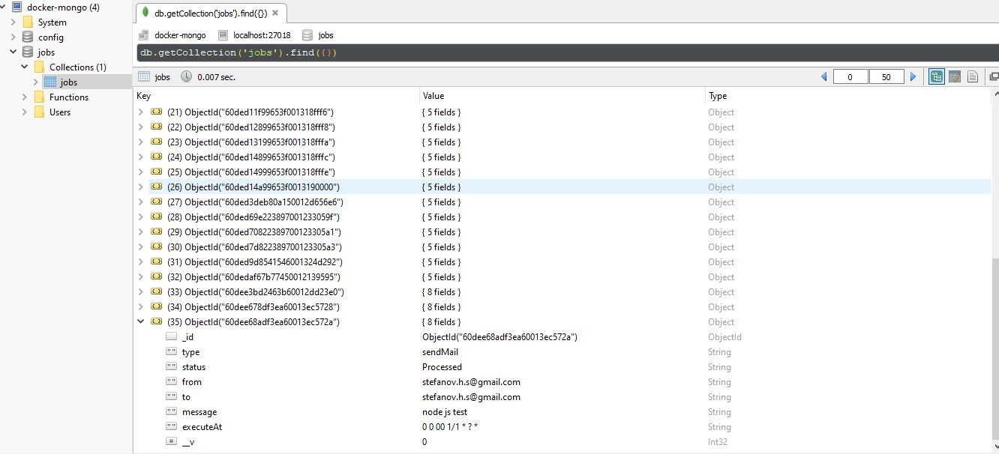

# Docker Compose

## Quick Start

Using Docker Compose is basically a three-step process:

1. Define your app's environment with a `Dockerfile` so it can be
   reproduced anywhere.
2. Define the services that make up your app in `docker-compose.yml` so
   they can be run together in an isolated environment.
3. Lastly, run `docker-compose up` and Compose will start and run your entire
   app.

## General architecture

## How to run the app

1. Run `docker-compose up --scale worker=2` or any other number of workers of your choice.
2. This should pull all the needed images on your local machine (node:alpine; redis:alpine, mongo) if not already present.
3. You can pass to the command `-d` to run silently in the background. `docker-compose up -d --scale worker=2`
4. After a while all the services should be ready. The client is setup to run on `localhost:3000`
5. When open the client, you will be promped to provide on options of cron-like expression tab, for triggering task, and a from with inputs for origin of the email, recepient and message.
6. When click `Send mail`, the system should write the task into `MongoDB` and push a message into the queue (`Redis`) for all subscribers to Process the message.
   
7. Any of the subscriber checks wheather the message is not already process and if not enqueue the message into MailGun API.
8. Please check your spam if you are trying to test with your personal email :)
